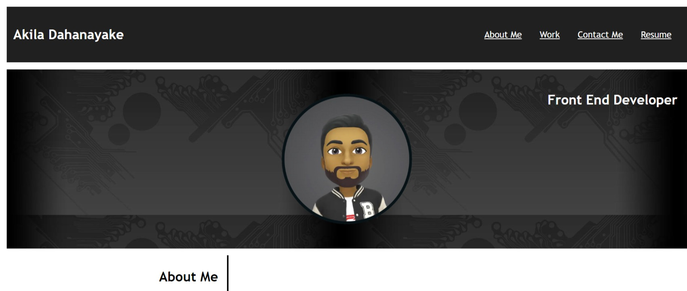

# Responsive-Portfolio 

## Description 

The main object of the project was to create an initial portfolio, using the template given from the bootcamp. 

The reason for doin this project is to showcase projects we have done, but in this case as I have not done any prior projects the work area contain pictures of placeholders.A portfolio is especially useful to showcase your skills and talents to employers when looking for work. Additionally, this project was done to make sure our understanding of basic CSS such as grids, flex box and media queries is well consolidated, and can be practically put to use. 

From this project I aquired many skills, as I had to learn from the basics a good undestanding the flexbox, how padding, margin, and borders all relate when using border box vs content box.When to use different units for example as a general rule of thumb I used rems for font size, em for padding, margin and border radiuses, and finally pixels for borders. Furthermore I had learned a lot in how to apply grid. One of the most important this I learned was how to use media queries to make the webpage more responsive when it comes to switching between different sizes, as if the webpage is not made responsive you can get overflow.

## Installation

N/A 

## Usage

To see the completed website please visit :
https://akila504.github.io/Responsive-Portfolio/

## Credits
Book that helped greatly :  
CSS in depth by Keith J. Grant
https://www.manning.com/books/css-in-depth

## License
MIT licence 

